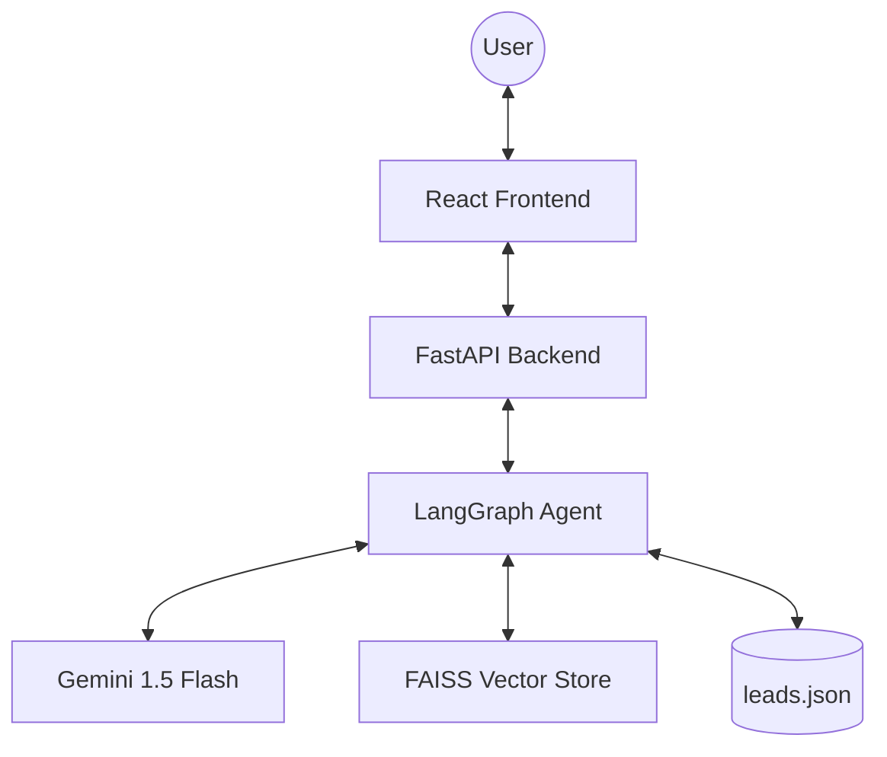

# 🚀 Inflx by AutoStream

### Social-to-Lead Agentic Workflow Platform

**Inflx** is a production-grade Social-to-Lead Agentic Workflow platform built as the AI-powered agent layer for **AutoStream**, a fictional SaaS company offering automated video editing tools for content creators. 

The platform leverages **Google Gemini 1.5 Flash** orchestrated through **LangGraph** to build a stateful, multi-turn conversational agent capable of intent classification, product knowledge retrieval (RAG), and autonomous lead capture.

---

## 📺 Demo & Screenshots

> [!TIP]
> *Insert demo video/GIF here*

- **Landing Page**: Modern conversion-focused marketing page.
- **AI Chat**: Real-time interface with a live **State Inspector** for agent transparency.
- **Leads Dashboard**: Intelligence portal with analytics, charts, and CSV export.
- **Docs Portal**: Searchable product knowledge base.

---

## 🏗️ Architecture

### High-Level System Flow
The system follows a client-server architecture with a clear separation of concerns:



### LangGraph Agent Workflow
The agent is modeled as a stateful graph with deterministic routing:
1.  **Intent Classifier**: Analyzes user input (Greeting, Inquiry, or High Intent).
2.  **RAG Node**: Retrieves knowledge from `knowledge_base.md` using FAISS.
3.  **Lead Capture**: Collects user details (Name, Email, Platform) through natural conversation.
4.  **Tool Gate**: Validates data and persists lead records.

---

## 🛠️ Technical Stack

| Layer | Technology |
| :--- | :--- |
| **Backend** | Python, FastAPI, Uvicorn |
| **Agent** | LangGraph, LangChain |
| **LLM** | Google Gemini 1.5 Flash |
| **Vector DB** | FAISS (In-memory) |
| **Embeddings** | Google Generative AI Embeddings |
| **Frontend** | React 18, TypeScript, Vite |
| **Styling** | Tailwind CSS, Framer Motion |
| **State** | Zustand (UI/Agent), React Query (Server State) |

---

## 🏃 Running Steps

### Prerequisites
- Python 3.11+
- Node.js 18+
- Google AI Studio API Key (Get it at [aistudio.google.com](https://aistudio.google.dev/))

### 1. Backend Setup
```bash
cd inflx-autostream/backend
python -m venv venv
# Windows:
.\venv\Scripts\Activate.ps1
# Unix:
source venv/bin/activate

pip install -r requirements.txt
cp .env.example .env # Add your GOOGLE_API_KEY
python main.py
```

### 2. Frontend Setup
```bash
cd inflx-autostream/frontend
npm install
npm run dev
```

The app will be available at `http://localhost:5173`.

---

## 📱 WhatsApp Integration Strategy

The backend is architected to support WhatsApp deployment through two primary methods:

### Method A: Twilio (Sandbox/Production)
- Register a webhook pointing to `/webhook/whatsapp`.
- Uses `twilio` Python library to send/receive TwiML.

### Method B: Meta Graph API (Direct)
- Configure a Meta Business App.
- Set up a webhook at `/webhook/meta` for verification and event handling.
- Uses Meta's Cloud API to send structured messages.

---

## 📊 Leads Intelligence
Leads are persisted to `leads.json` and can be viewed in the dashboard. The dashboard includes:
- **Total Leads** & **Daily Stats**.
- **Platform Breakdown**: Distribution across YouTube, TikTok, Instagram, etc.
- **Conversion Analytics**: Average turns to conversion.
- **Export**: Download full lead history as CSV.

---

## 📜 Documentation & PRD
Detailed documentation is available in the following files:
- [DESIGN.md](./DESIGN.md) - UI/UX Design System and components.
- [PRD.md](./PRD.md) - Product Requirements and Scope.
- [TECHNICAL_STACK.md](./TECHNICAL_STACK.md) - Detailed architecture and justifications.

---

*Developed for the ServiceHive Machine Learning Internship Assignment.*
